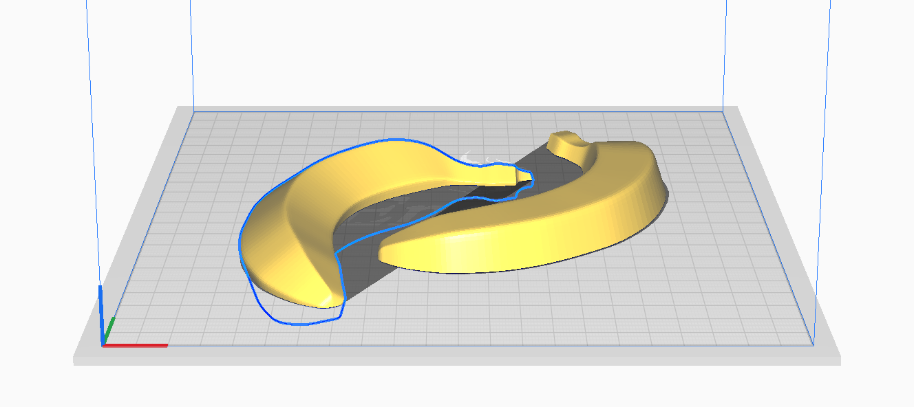

Banana Split plugin for Cura
=================

Split model with one easy action. Imagine splitting a banana neatly in half with a quick swing of a katana. That's how easy it is. Although, technically splitting is not what is really happening...

The tool actually duplicates a selected model, flips it around, and then actively mirrors the Z value in relation to the build plate—sort of like a [zeesaw](https://www.youtube.com/watch?v=iPxPK4d8FN4). Here's how to use it:

1. Position your model in a way that roughly half of the model goes below the build plate.
2. Press Split button, and the tool will reflect anything below the surface on top of it.
3. Move your original model along the Z axis to fine tune your cut real-time.

Banana.stl used in experimenting by [booom](https://www.thingiverse.com/thing:2141725) [(CC BY 4.0)](https://creativecommons.org/licenses/by/4.0/).

Serving
---------

Serve.sh is there just to make deployment a bit snappier. It's not pretty, but works on my Mac at least. Update the PLUGINS_PATH to match the version of your Cura installation and CURA_VERSION. Version can be also passed as parameter. Note: the deployment will shutdown any running Cura instances.

TODO
---------
- Ignore rotation along build plate (seems SceneNode.getOrientation() may have a bug, which makes this rather difficult)
- Use Cura SDK/API to avoid compatibility issues in the future
- Localizations...
- An actual banana split

